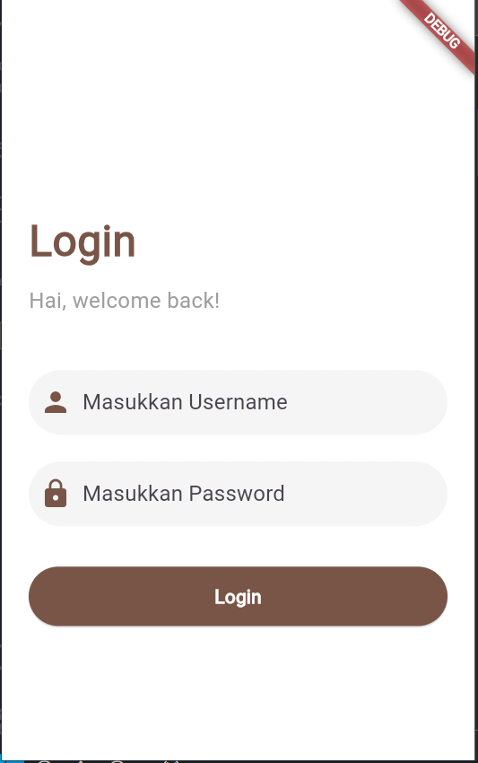
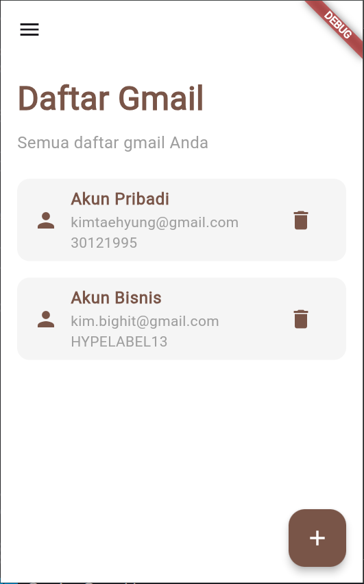
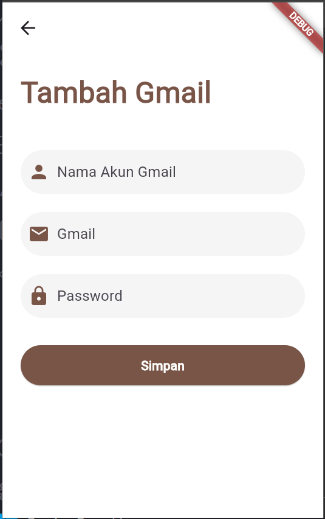
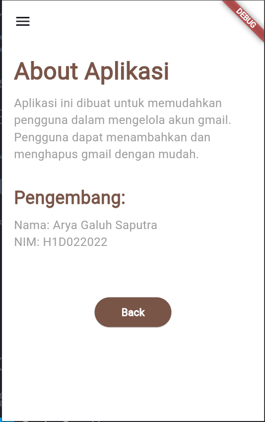
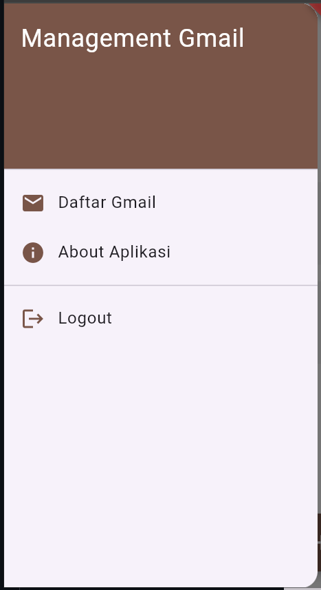

# Tugas Pertemuan 3

- **Nama** : Arya Galuh Saputra
- **NIM** : H1D022022
- **Shift Lama** : C
- **Shift Baru** : B

---

# Aplikasi Management Gmail

## Fitur Login

1. **`TextEditingController _usernameController` dan `TextEditingController _passwordController`**:

   - Digunakan untuk menangkap masukan dari user di kolom username dan password.

2. **`_showInput` Method**:

   - Membuat widget `TextField` yang di-custom dengan parameter seperti controller, placeholder, input password (obscureText), dan ikon.

3. **`_showDialog` Method**:

   - Menampilkan `AlertDialog` ketika user melakukan login, baik berhasil ataupun gagal. Tombol di dialog ini mengarahkan user ke halaman lain, seperti `HomePage` atau tetap di `LoginPage`.

4. **`_saveUsername` Method**:

   - Menggunakan `SharedPreferences` untuk menyimpan username ke dalam storage lokal, sehingga user bisa login dan tetap tersimpan.

5. **`onPressed` di tombol Login**:
   - Mengecek apakah username dan password benar, jika benar, username disimpan dan dialog sukses muncul, jika salah, dialog error muncul.

## Fitur Management Gmail

1. **`_loadGmail` Method**:

   - Mengambil gmail yang tersimpan dari `SharedPreferences` dan mem-parsing-nya menjadi `List<Map<String, String>>` untuk ditampilkan di layar.

2. **`_addGmail` dan `_deleteGmail` Methods**:

   - Menambah atau menghapus gmail pada `SharedPreferences`, lalu memuat ulang daftar gmail agar tampilan ter-update.

3. **`TextEditingController` untuk Name, Gmail, dan Password**:

   - Kontroller untuk menangkap masukan dari user terkait informasi gmail yang ingin ditambahkan.

4. **`_showInput` Method**:

   - Sama seperti pada halaman login, berfungsi untuk membuat `TextField` yang menampilkan masukan untuk nama akun gmail, gmail, dan password.

5. **`ElevatedButton` dengan onPressed**:
   - Ketika tombol "Simpan" ditekan, jika nama akun gmail, gmail, dan password sudah diisi, gmail baru akan dikirim balik ke `HomePage` menggunakan `Navigator.pop`, dan disimpan di sana.

## Fitur Logout

1. **`_logout` Method**:
   - Ketika pengguna menekan logout, `SharedPreferences` menghapus username yang tersimpan dan membawa pengguna kembali ke halaman login dengan `Navigator.pushAndRemoveUntil`, menghapus semua halaman sebelumnya dari stack.

---

# Screenshot

  
  

  
  

  

